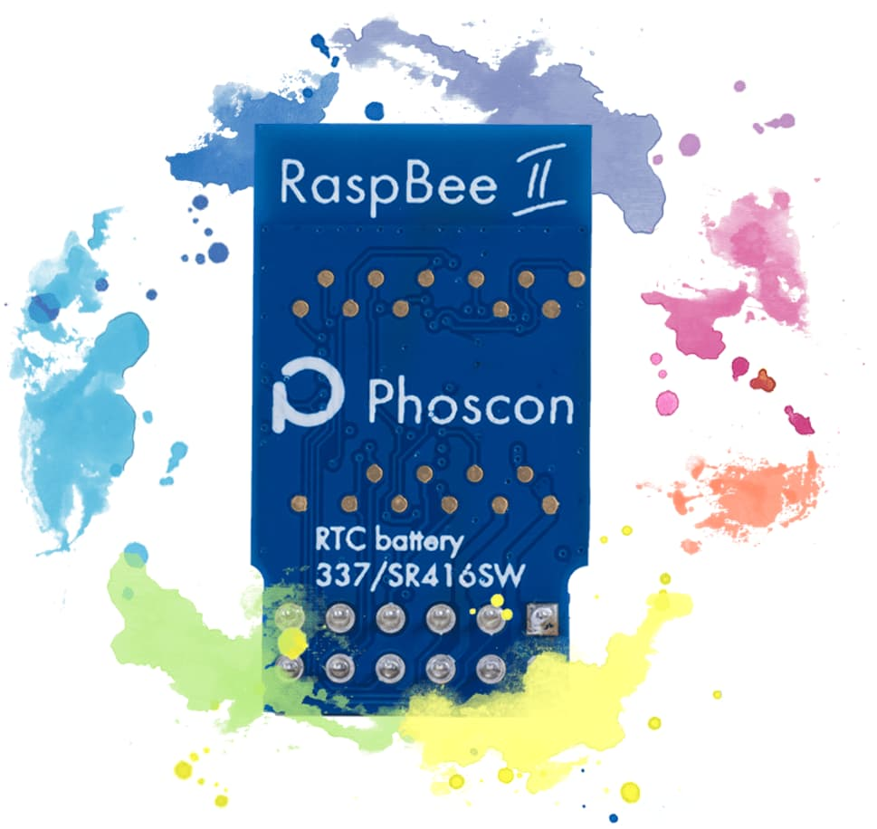
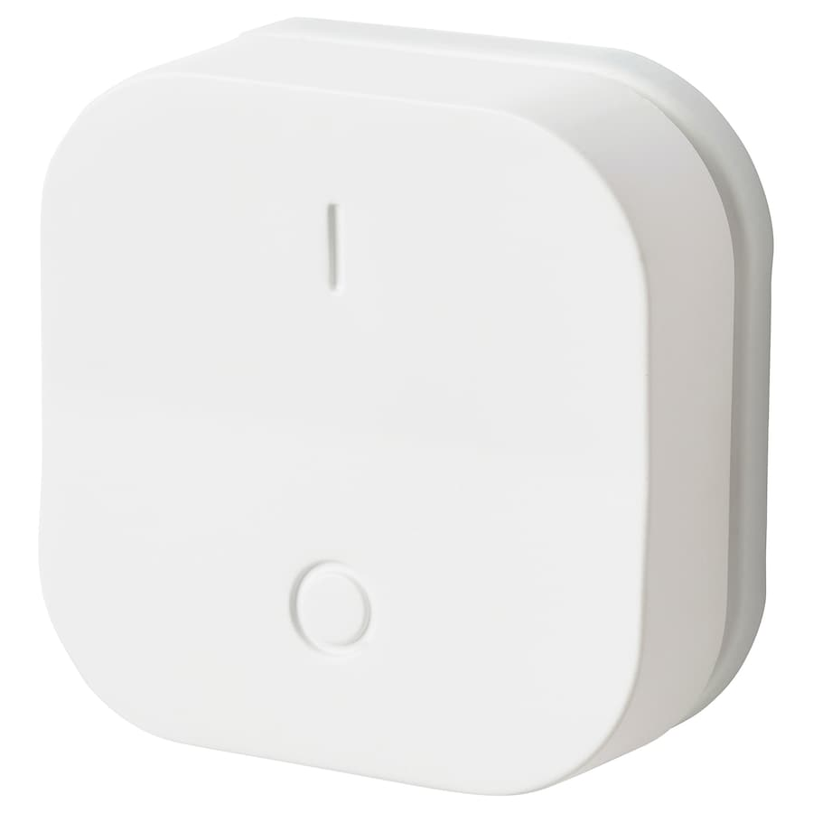
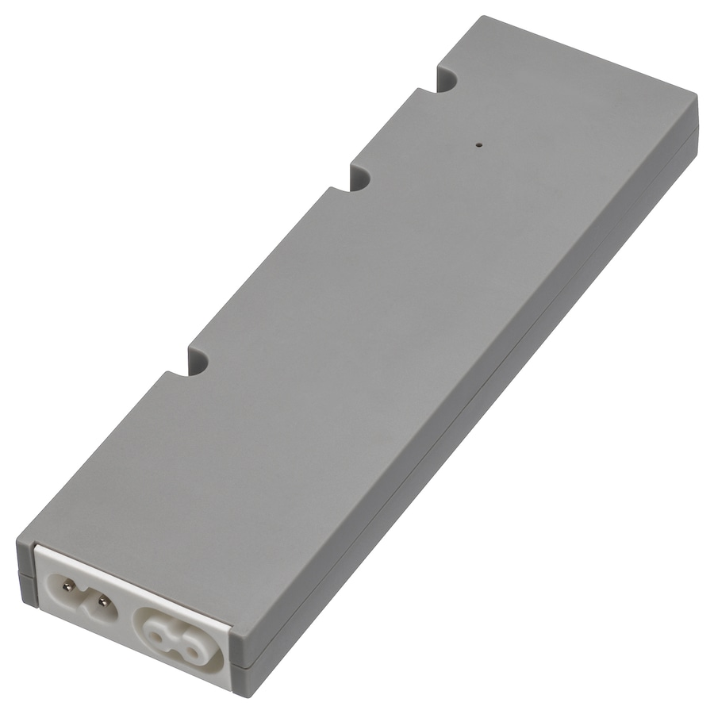
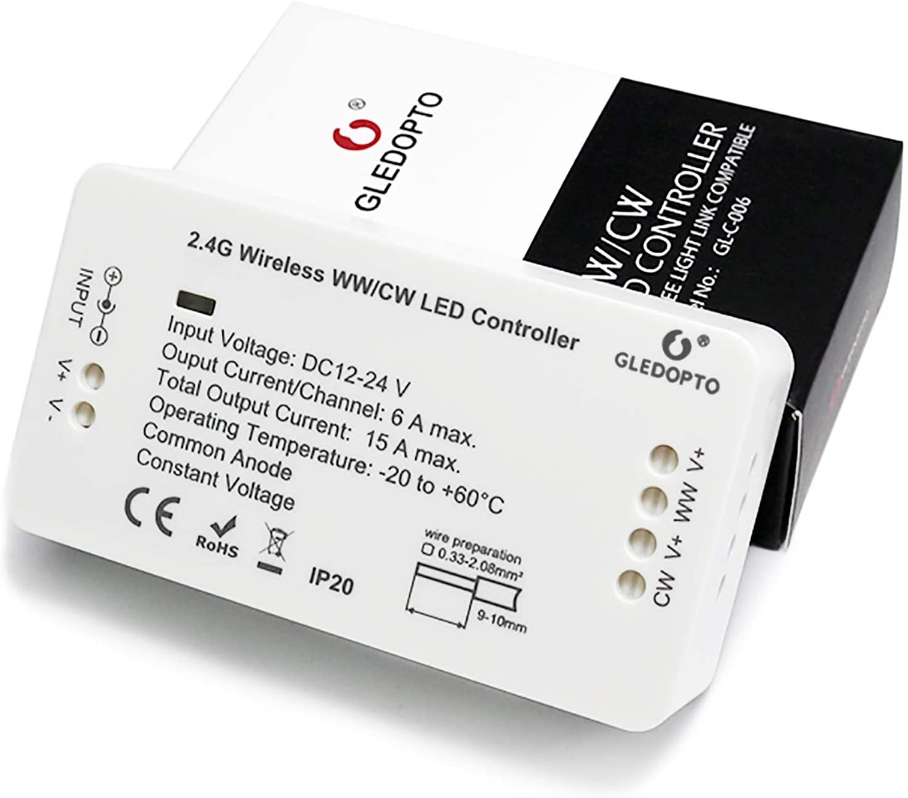

# Deconz for rasbee2

This is a docker-compose file to run deconz for a [raspbee2](https://phoscon.de/en/raspbee2).  
My configuration is tested on a raspberry pi 3.

## Devices

A list of devices I have tested.

### Switches

| | |
| --- | --- |
| [Ikea Tradfri Dimmer](https://www.ikea.com/de/de/p/tradfri-kabelloser-dimmer-weiss-70408595/) |  |

### Light Drivers/Controllers

| | |
| --- | --- |
| [Ikea Tradfri Driver](https://www.ikea.com/de/de/p/tradfri-treiber-fuer-fernbedienung-grau-50356187/) |  |
| [GLEDOPTO WW/CW LED Controller](https://www.amazon.de/gp/product/B07V6KXN8P/ref=ppx_yo_dt_b_asin_title_o00_s00?ie=UTF8&psc=1) |  |
